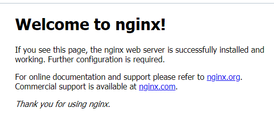

## Set up and install LEMP Stack on Ubuntu (Using Azure VM)
### Prerequisites
1. Create an Azure account to be able to use the the CLI within the Azure Cloud Shell or use the Azure sandbox (you must have at least a Microsoft account https://account.microsoft.com/account)
2. If you choose to install and use the CLI locally, ensure you are running the Azure CLI version 2.0.30 or later. Run az --version to find the version. If you need to install or upgrade, see https://docs.microsoft.com/en-us/cli/azure/install-azure-cli.

We commence by creating a Linux VM and installing Nginx. but using the Azure CLI. The Azure CLI enables you to connect to Azure and run administrative commands on Azure resources. 

You access the Azure CLI from Azure Cloud Shell. Cloud Shell is a browser-based shell experience that you use to manage and develop Azure resources. Think of Cloud Shell as an interactive console that runs in the cloud.

### Create a resource group
Create a resource group with the *az group* create command. An Azure resource group is a logical container into which Azure resources are deployed and managed.

The following example creates a resource group named *myResourceGroup* in the *eastus* location.

`az group create --name myResourceGroup --location eastus`

### Create a Linux virtual machine

Create a VM with the *az vm create* command.

The following example creates a VM named myVM and creates SSH keys if they do not already exist in a default key location. To use a specific set of keys, use the *--ssh-key-value* option. The command also sets azureuser as an administrator user name. You use this name later to connect to the VM.

```
az vm create \
    --resource-group myResourceGroup \
    --name myVM \
    --image UbuntuLTS \
    --admin-username azureuser \
    --generate-ssh-keys
```

Your VM will take a few moments to come up.

You name the VM *myVM*. You use this name and also the publicIpAddress to refer to the VM in later steps.
```
{
  "fqdns": "",
  "id": "/subscriptions/<subscription ID>/resourceGroups/myResourceGroup/providers/Microsoft.Compute/virtualMachines/myVM",
  "location": "eastus",
  "macAddress": "00-0D-3A-23-9A-49",
  "powerState": "VM running",
  "privateIpAddress": "10.0.0.4",
  "publicIpAddress": "40.68.254.142",
  "resourceGroup": "myResourceGroup"
}
```

You can also get access your ip by :
1. Running the following az vm list-ip-addresses command to get your VM's IP address and store the result as a Bash variable named 'IPADDRESS':

```
IPADDRESS="$(az vm list-ip-addresses \
  --resource-group [sandbox resource group name] \
  --name my-vm \
  --query "[].virtualMachine.network.publicIpAddresses[*].ipAddress" \
  --output tsv)"
```

You can view your VM's ip address by typing: 

`echo $IPADDRESS`

### Open port 80 for web traffic

Naturally, beacuse this is an Azure VM, Network Security Group (NSG) is the equivalence of Security in AWS. Every VM on Azure is associated with at least one network security group. 

First we examine the NSG to see the rules inherent. Run this command:

```
az network nsg rule list \
  --resource-group [sandbox resource group name] \
  --nsg-name my-vmNSG \
  --query '[].{Name:name, Priority:priority, Port:destinationPortRange, Access:access}' \
  --output table
```

Some few parameters used in the above command are worth explaining.

>The --query argument used here is to help retrieve only the name, priority, affected ports, and access (Allow or Deny) for each rule.

>The --output argument formats the output as a table so that it's easy to read (You can output in yaml or json if you want).

```
Output

Name               Priority    Port    Access
-----------------  ----------  ------  --------
default-allow-ssh  1000        22      Allow
```

You see the default rule, default-allow-ssh. This rule allows inbound connections over port 22 (SSH), but the priority of this rule is 1000. Rules are processed in priority order, with lower numbers processed before higher numbers.

Use the az vm open-port command to open the desired port.


`az vm open-port --port 80 --resource-group myResourceGroup --name myVM`

### SSH into your VM
Use the following command to create an SSH session with the virtual machine. Substitute the correct public IP address of your virtual machine. In this example, the *azureuser* is the administrator user name set when you created the VM.

`ssh azureuser@40.68.254.142`

### Install Nginx, MySQL, and PHP

` sudo apt update && sudo apt install nginx`

By default, this installs Nginx and sets the home page, /var/www/html/index.html. 
To verify that nginx was successfully installed and is running as a service in Ubuntu, run:

`$ sudo systemctl status nginx`
### Access your web server
You can now visit your Nginx server by opening a web browser of your choice and try to access following url:

`http://<Public-IP-Address>:80`



### Installing the "M" in the Stack.
Now that we've got a web server up and running, we need to install the database system to be able to store and manage data for your site. Due to our choice of stack, MySQL is the exact choice.

Install the db with:

`sudo apt install mysql-server`

For more security. Run the command below

`sudo mysql_secure_installation`

You'd get a lot of prompts at this point. Pick your choice on discretion and as you deem fit.

When you're done, test if you're able to log in 

`sudo mysql`

You can clear your screen with "CTRL + L" and exit the MySQL console, by typing:

`mysql> exit`
```
Output 

Welcome to the MySQL monitor.  Commands end with ; or \g.
Your MySQL connection id is 10
Server version: 8.0.23-0ubuntu0.20.04.1 (Ubuntu)

Copyright (c) 2000, 2021, Oracle and/or its affiliates.

Oracle is a registered trademark of Oracle Corporation and/or its
affiliates. Other names may be trademarks of their respective
owners.

Type 'help;' or '\h' for help. Type '\c' to clear the current input statement.

mysql> exit
Bye

```
### The final "P" in the S(t)ack
While Apache embeds the PHP interpreter in each request, Nginx requires an external program to handle PHP processing and act as a bridge between the PHP interpreter itself and the web server. This allows for a better overall performance in most PHP-based websites, which is mostly why Nginx has a higher vote as the most preferred web server of choice. 

You’ll need to install **php-fpm**, which stands for “PHP fastCGI process manager”, and tells Nginx to pass PHP requests to this software for processing. Additionally, you’ll also need **php-mysql**, a PHP module that allows PHP to communicate with MySQL-based databases. Core PHP packages will automatically be installed as dependencies.

You can run:

`$ sudo apt install php-fpm php-mysql`

### Configuring Nginx to Use PHP Processor

Nginx uses server blocks (similar to virtual hosts in Apache) to encapsulate configuration details and host more than one domain on a single server. 

While the default is **/var/www/html** works well for a single site, it can become difficult to manage if you are hosting multiple sites. We’ll create a directory structure within /var/www for the our_domain website, leaving /var/www/html untouched as the default directory to be served if a client request does not match any other sites.

Create the root web directory for our_domain as follows:

`$ sudo mkdir /var/www/Lempard`

Then, open a new config file in Nginx’s sites-available using your preferred command-line editor. Here, we’ll use vi:

`$ sudo vi /etc/nginx/sites-available/Lempard`

Paste in the following bare-bones configuration:

```

server {
    listen 80;
    server_name Lempard www.Lempard;
    root /var/www/Lempard;

    index index.html index.htm index.php;

    location / {
        try_files $uri $uri/ =404;
    }

    location ~ \.php$ {
        include snippets/fastcgi-php.conf;
        fastcgi_pass unix:/var/run/php/php7.4-fpm.sock;
     }

    location ~ /\.ht {
        deny all;
    }

}
```

You then need to activate your configuration by doing a sym- link (symbolic link) to the config file from Nginx’s sites-enabled directory:

`$ sudo ln -s /etc/nginx/sites-available/Lempard /etc/nginx/sites-enabled/`

You can test your configuration for any syntax errors by typing:

`$ sudo nginx -t`

```
Output
nginx: the configuration file /etc/nginx/nginx.conf syntax is ok
nginx: configuration file /etc/nginx/nginx.conf test is successful
```

There's also a need to disable default Nginx host that is currently configured to listen on port 80, for this run:

`sudo unlink /etc/nginx/sites-enabled/default`

Reload Nginx to apply the changes:

`$ sudo systemctl reload nginx`

Next, we create an index.html file in that /var/www/Lempard so that we can test that your new server block works as expected:
```
sudo echo 'Hello LEMP from hostname' $(curl -s http://169.254.169.254/latest/meta-data/public-hostname) 'with public IP' $(curl -s http://169.254.169.254/latest/meta-data/public-ipv4) > /var/www/Lempard/index.html
```
Visit your browser and try to open your website URL using IP address:

*http://Public-IP-Address:80*

We'd be leaving this file in place as a landing page for your application until we set up an index.php file to replace it. 

### Testing PHP with Nginx
The ideal thing to do now is to test and validate that Nginx can correctly hand .php files off to your PHP processor.

We do this by creating a test PHP file in the document root. Open a new file called validate.php within the document root using whatever editor:

`$ sudo vi /var/www/Lempard/validate.php`

Type the following lines into the new file. This is a PHP code that will return information about your server:

``<?php
phpinfo();``

You can now access this page in your web browser by visiting the  public IP address you’ve set, followed by /validate.php:

http://`server_domain_or_IP`/validate.php

You will see a web page containing detailed information about your server


This file is not meant to be long-lived as it contains senistive data about your PHP Server, so it's best removed immediately after viewing it.

`$ sudo rm /var/www/Lempard/validate.php`

###  Retrieving data from MySQL database with PHP

This step is just to test if our PHP can query and successfully fetch data from the MySQL DB. 
First, we start by creating a Test DB with a simple “To do list” and configure access to it, so the Nginx website would be able to query data from the DB and display it.

We'll create and name the  database as *molo_db* and a user named *molo*.

Connect to the MySQL console using the root account and create the db and user with the following commands:

`$ sudo mysql`

`mysql> CREATE DATABASE "molo_db";`

`
mysql>  CREATE USER "molo"@"%" IDENTIFIED WITH mysql_native_password BY '#@@8Ywyu';
`

>The following command creates a the new user using mysql_native_password as default authentication method. You should replace the password value with a secure password of your own choosing.

Exit the MySQL shell with:

`mysql> exit`

Test if the new user has the proper permissions by logging in to the MySQL console again, this time using the custom user credentials:

`$ mysql -u molo -p`

Next, we’ll create a test table named todo_list. From the MySQL console, run the following statement:

```
CREATE TABLE example_database.todo_list (
mysql>     item_id INT AUTO_INCREMENT,
mysql>     content VARCHAR(255),
mysql>     PRIMARY KEY(item_id)
mysql> );
```

To confirm that the data was successfully saved to your table, run:

`mysql> SELECT * FROM example_database.todo_list;`
```
Output
+---------+--------------------------+
| item_id | content                  |
+---------+--------------------------+
|       1 | My first important item  |
|       2 | My second important item |
|       3 | My third important item  |
|       4 | and this one more thing  |
+---------+--------------------------+
4 rows in set (0.000 sec)
```

You can exit the MySQL console:

`mysql> exit`

The next thing to do is to create a PHP script that will connect to MySQL and query for the content. 
Create a new PHP file in your custom web root directory using your preferred editor:

`$ sudo vi /var/www/Lempard/todo_list.php`

The following PHP script connects to the MySQL database and queries for the content of the todo_list table, displays the results in a list. If there is a problem with the database connection, it will throw an exception.

Copy this content into your todo_list.php script:
```
<?php
$user = "molo";
$password = "password";
$database = "molo_db";
$table = "todo_list";

try {
  $db = new PDO("mysql:host=localhost;dbname=$database", $user, $password);
  echo "<h2>TODO</h2><ol>";
  foreach($db->query("SELECT content FROM $table") as $row) {
    echo "<li>" . $row['content'] . "</li>";
  }
  echo "</ol>";
} catch (PDOException $e) {
    print "Error!: " . $e->getMessage() . "<br/>";
    die();
}
```
Save and exit the file with *:wq*.

You can now access this page in your web browser by visiting the public IP address configured for your website, followed by /todo_list.php:

`http://<Public_domain_or_IP>/todo_list.php`

You should see a page like this, showing the content you’ve inserted in your mysql table:


Congratulations!! You've just set up your own LEMP Stack using an Azure Ubuntu VM.